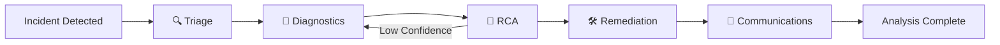
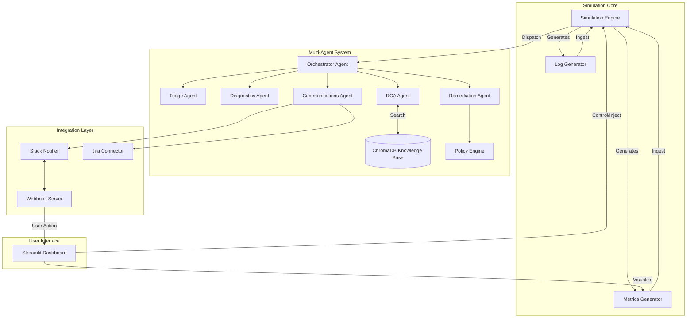

# OPS Agent — AI-Driven Multi-Agent Incident Response System

## 1. Project Overview
The **OPS Agent** is an AI-driven Operational Support Agent designed to simulate, detect, analyze, and resolve production incidents autonomously. It operates as a **multi-agent SRE team** — five specialized AI agents coordinate through an orchestrator to handle the full incident lifecycle: from triage to root cause analysis to remediation and external communications.

## 2. Multi-Agent Architecture

### Agent Team

| Agent | Role | Key Capability |
|:------|:-----|:----------------|
| 🔍 **Triage Agent** | First responder | Symptom extraction, severity classification (P1/P2/P3), urgency scoring |
| 🔬 **Diagnostics Agent** | Deep analysis | Log pattern correlation, affected service identification, LLM-enhanced summaries |
| 🧠 **RCA Agent** | Root cause analysis | RAG-powered knowledge base search, hypothesis ranking, LLM reasoning chains |
| 🛠️ **Remediation Agent** | Action planning | Policy safety checks, playbook selection, approval logic |
| 📡 **Communications Agent** | External notifications | Slack alerts with interactive buttons, Jira ticket creation |
| 🎯 **Orchestrator** | Central coordinator | Sequential pipeline management, feedback loops, workflow tracking |

### Pipeline Flow



### System Architecture



## 3. Key Features

- **Multi-Agent Coordination** — Five specialized agents work together via an in-process message bus
- **RAG-Powered Analysis** — Historical incident knowledge base (ChromaDB) for root cause matching
- **LLM Integration** — Optional OpenAI GPT-4o-mini for enhanced reasoning (graceful fallback to rule-based)
- **Feedback Loops** — Low-confidence RCA triggers expanded diagnostics automatically
- **Human-in-the-Loop** — Approve/deny actions via Dashboard or Slack interactive buttons
- **Policy Engine** — Safety checks prevent dangerous actions without human approval
- **Real-time Dashboard** — Agent pipeline visualization, per-agent detail tabs, conversation log
- **External Integrations** — Live Slack alerts and Jira ticket creation

## 4. Technologies Used

| Technology | Role |
|:-----------|:-----|
| **Python** | Core language for all backend, simulation, and agent logic |
| **Streamlit** | Real-time dashboard with agent pipeline visualization |
| **Flask** | Webhook server for Slack interactive callbacks |
| **ChromaDB** | Vector database for RAG-based incident knowledge base |
| **OpenAI** | LLM integration for enhanced agent reasoning (optional) |
| **Plotly** | Interactive metric charts |
| **PyNgrok** | Tunneling for Slack webhook connectivity |
| **Jira API** | Automated ticket creation and status management |
| **Slack SDK** | Rich interactive message posting |

## 5. Project Structure

```
OPS_agent/
├── dashboard/
│   └── app.py                     # Streamlit dashboard with multi-agent UI
├── data/
│   ├── historical_incidents.json  # RAG knowledge base (21 incidents)
│   └── pending_actions.json       # Slack webhook action queue
├── src/
│   ├── agent/                     # Multi-Agent System
│   │   ├── orchestrator.py        # Central coordinator & workflow FSM
│   │   ├── triage_agent.py        # Severity classification
│   │   ├── diagnostics_agent.py   # Deep log analysis
│   │   ├── rca_agent.py           # RAG-powered root cause analysis
│   │   ├── remediation_agent.py   # Action planning & policy check
│   │   ├── comms_agent.py         # Slack & Jira notifications
│   │   ├── base_agent.py          # Abstract base with timing
│   │   ├── message_bus.py         # In-process message bus
│   │   ├── llm_client.py          # OpenAI wrapper with mock fallback
│   │   └── models.py              # Data models for agent reports
│   ├── simulation/                # Simulation Engine
│   │   ├── engine.py              # Tick-based simulation loop
│   │   ├── incident.py            # Incident state machine
│   │   ├── state.py               # Incident lifecycle tracker
│   │   ├── metrics_generator.py   # Synthetic metrics (CPU, Memory, etc.)
│   │   ├── logs_generator.py      # Synthetic application logs
│   │   └── observations.py        # Log ingestion & feature extraction
│   ├── detection/
│   │   └── anomaly_model.py       # Rule-based + ML anomaly detection
│   ├── integration/
│   │   ├── slack_client.py        # Slack API integration
│   │   ├── jira_client.py         # Jira API integration
│   │   └── webhook_server.py      # Flask webhook endpoint
│   ├── orchestration/
│   │   └── policy_engine.py       # Action safety classification
│   └── rag/
│       └── vector_db.py           # ChromaDB knowledge base
├── run_demo_server.py             # Webhook + Ngrok startup
├── startup.sh                     # One-command launcher
├── requirements.txt               # Python dependencies
└── .env                           # API keys & configuration
```

## 6. Running the System

```bash
# Install dependencies
pip install -r requirements.txt

# Option 1: Full system (Dashboard + Webhook Server)
bash startup.sh

# Option 2: Dashboard only
streamlit run dashboard/app.py

# Option 3: Webhook server only (for Slack integration)
python3 run_demo_server.py
```

## 7. Enabling LLM Mode

Add your OpenAI API key to `.env`:
```
OPENAI_API_KEY="sk-your-key-here"
```
When set, agents use GPT-4o-mini for enhanced reasoning. When empty, agents use fully functional rule-based logic.
